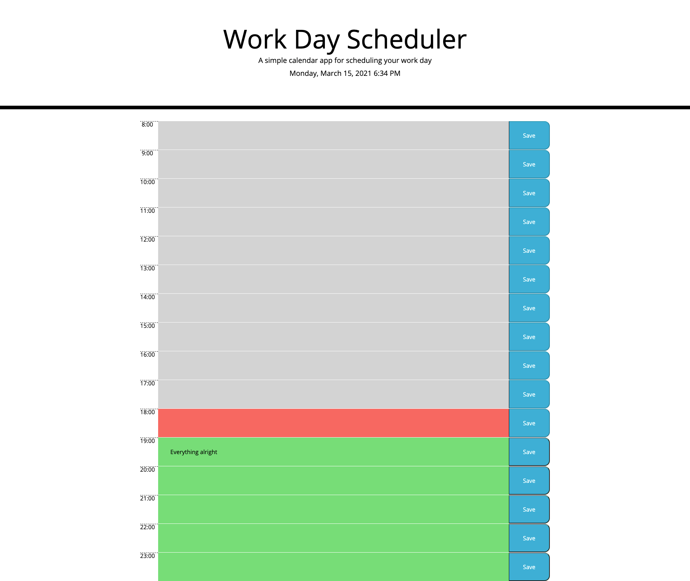

<h1>Work Day Scheduler Starter Code</h1>

<h2>Purpose</h2>

Deploy a functional work-Calendar app with Local Storage and Moment.js implemented

<h2>Coding Languages used</h2>

  <ul>
    <li> HTML </li>
    <li> CSS </li>
    <li> JAVASCRIPT </li>
  </ul>

<h2>Web Application URL</h2>
<a href="https://walterego95.github.io/work-scheduler-assignment/">Walter Scimone Work Day Scheduler</a>

<h2>Landing Web App Image</h2>

<footer>
  <h2>Contribution</h2>
  
Made with ❤️️ by Walter Scimone

    </footer>
